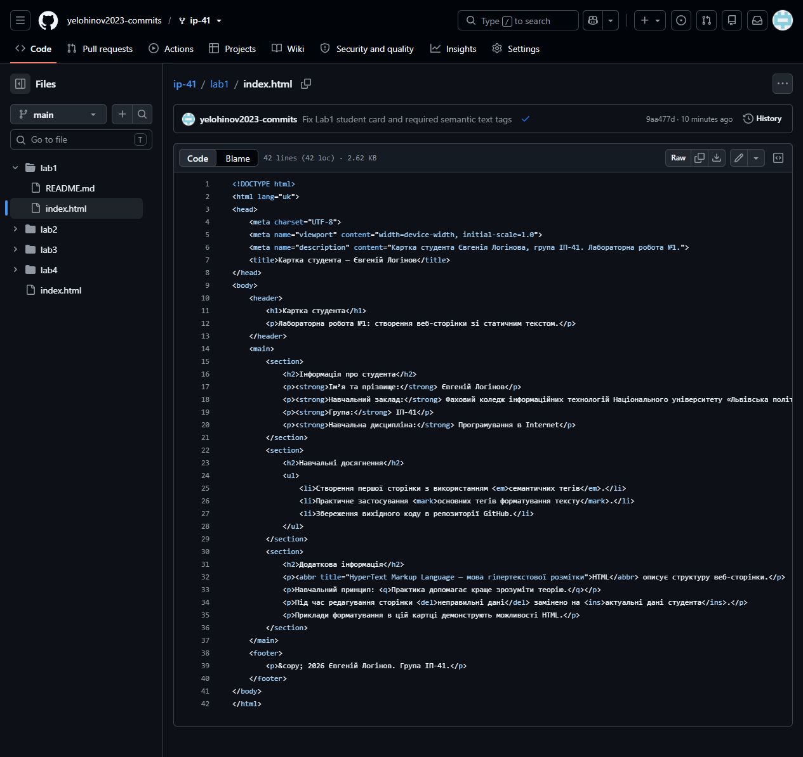
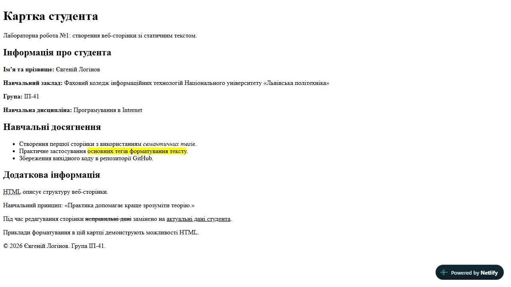

# Лабораторна робота №1
**Тема:** Створення веб-сторінки зі статичним текстом та розміщення в інтернеті  
**Студент:** Євгеній Логінов  
**Група:** ІП-41  
**Дисципліна:** Програмування в Internet

## 1. Мета роботи
Навчитися створювати веб-сторінки зі статичним текстом, розуміти структуру HTML-документа та застосовувати семантичні теги.

## 2. Теоретичні відомості
HTML описує структуру документа. Оголошення `<!DOCTYPE html>` задає HTML5. Кореневий елемент `html` охоплює `head` і `body`. У `head` містяться кодування, налаштування області перегляду, опис та назва вкладки. У `body` розташований видимий вміст.

Семантичні елементи пояснюють призначення блоків сторінки браузерам, пошуковим системам та допоміжним технологіям. Заголовки мають утворювати логічну ієрархію.

## 3. Завдання
Створити файл `index.html` із карткою студента, використати `header`, `main`, `section`, `footer`, заголовки та теги `strong`, `em`, `mark`, `q`, `abbr`, `ins`, `del`. Перевірити сторінку в браузері й розмістити її на Netlify. Підготувати звіт та URL для Classroom.

## 4. Звіт по роботі
Вихідний код розташований у [lab1/index.html](index.html). Сторінка містить інформацію про студента, приклади навчальних досягнень і додаткову інформацію. Текстові приклади демонструють форматування; вони не є заявами про отримані нагороди чи сертифікати.

Виправлено дані студента та структуру заголовків. Додано всі обов’язкові елементи форматування. Для українського тексту задано UTF-8 і `lang="uk"`.

### Пояснення тегів
| Тег | Призначення |
| --- | --- |
| `html` | Кореневий елемент документа; `lang` задає мову |
| `head` | Метадані документа |
| `meta` | Кодування, viewport та опис |
| `title` | Назва вкладки браузера |
| `body` | Видимий вміст |
| `header` | Вступна частина картки |
| `main` | Основний вміст; використовується один раз |
| `section` | Тематичний розділ із заголовком |
| `footer` | Завершальна інформація |
| `h1`, `h2` | Головний заголовок і заголовки розділів |
| `p` | Абзац |
| `ul`, `li` | Невпорядкований список та його пункт |
| `strong` | Важливий текст |
| `em` | Смисловий наголос |
| `mark` | Виділення тексту маркером |
| `q` | Коротка цитата |
| `abbr` | Скорочення; `title` містить розшифрування |
| `del` | Видалений текст |
| `ins` | Доданий текст |

## 5. Питання вихідного контролю
**4.1. Які теги використовуються в заголовку HTML-сторінки?**  
У секції `head` застосовано `meta` і `title`. Якщо йдеться про видимі заголовки, використовуються `h1`–`h6`.

**4.2. Який тег використовується для виводу параграфу тексту?**  
Тег `p`.

**4.3. Для чого використовувати семантичні теги?**  
Вони визначають роль частин документа, полегшують підтримку коду, навігацію допоміжними технологіями та індексацію.

**4.4. Які кроки необхідні для розміщення сторінки на Netlify?**  
Увійти через навчальний акаунт; імпортувати репозиторій GitHub; вибрати гілку `main`; залишити команду збірки порожньою для статичного HTML і встановити каталог публікації `lab1`; виконати розгортання; відкрити отриманий URL і перевірити сторінку. Розгортання виконано для цієї роботи.

**4.5. Схема клієнт-серверної архітектури**
```text
Браузер (клієнт) ── HTTPS GET / ──> Netlify (сервер/CDN)
Браузер (клієнт) <── HTML-документ ── Netlify (сервер/CDN)
        │
        └── інтерпретує HTML і відображає картку студента
GitHub ── вихідний код під час розгортання ──> Netlify
```

## 6. Висновки
Створено статичну картку студента з логічною структурою та обов’язковими тегами форматування. Вихідний код збережено у GitHub.

## 7. Публікація та перевірка
Сторінку опубліковано з репозиторію GitHub, гілки `main`, каталогу `lab1`, без команди збірки.
URL: https://dancing-capybara-1bdfbd.netlify.app/

Перевірено відображення картки в браузері: правильні ім’я та група, три розділи, заголовки й форматування тексту. Сайт переведено в публічний режим.

### Скріншот вихідного коду


### Скріншот сторінки


Файл `student_card.jpg`, згаданий в інструкції, не прикріплений до завдання. Точну відповідність графічному прототипу не перевірено.
